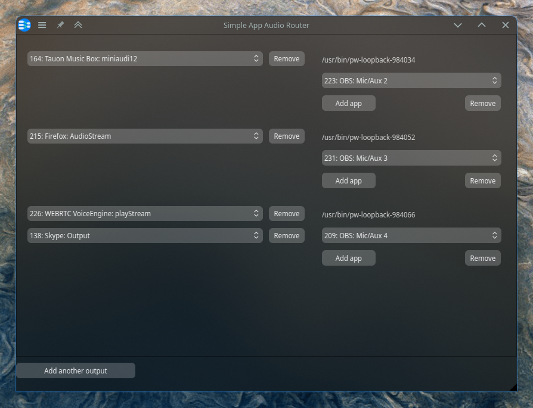

# simple-app-audio-router

Route audio from apps into virtual output devices for capture with obs or other similar software

## But why?

This allows me to have control over the volume of Desktop audio, my Mic, Discord, a music player, and a game for
example, all separately

I wanted to be able to easily separate the audio of apps when recording my screen with OBS.
OBS can record each of its input audio streams separately, so their volume can be controlled separately for example,
even after the recording is done.
But OBS cannot natively capture the audio from apps, only audio devices: so I did it myself.

This can be done using nothing by a patchbay app such as qpwgraph or helvum, but using them for this purpose is far too
tedious for my liking

## Usage

Simply clone this repo, and run `python main.py` or `python3 main.py` if your distro sets `python` to use `python2`
by default

- The left side shows dropdowns in which apps can be selected that are currently outputting audio
- Using the `Add app`  button, more apps can be selected
- Each selected app's audio is routed to a virtual loopback device, the name of which can be seen on the right
- To each virtual sink any number of apps can be routed
- There can be any number of virtual loopback devices

I recommend using a tool suck as `pavucontrol` to route the output of the virtual loopback devices to the input of a
desired app, such as OBS; and using an app such as `qpwgraph` or `helvum` to monitor what changes are being made to the
pipewire graph

## Dependencies

- Python>=3.10
- PyQt6 (to be able to use system themes, install it using the system package manager, not pip, (on Arch and Manjaro its python-pyqt6))
- pipewire
- pipewire-pulse
- pipewire-session-manager (WirePlumber is recommended)
 
If pipewire is not the default please consult your distro's instructions for installing pipewire